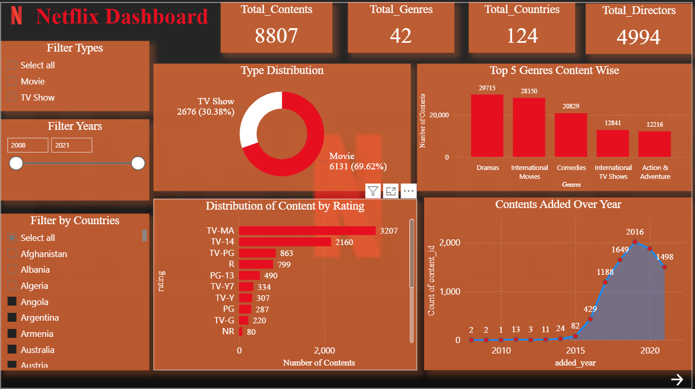
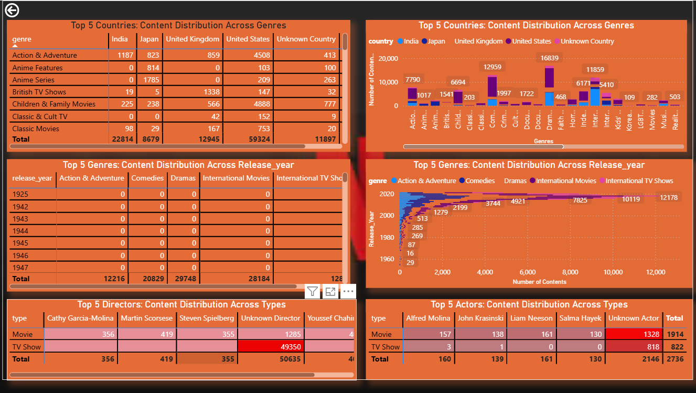

# **📊 Netflix Movies & TV Shows — Exploratory Data Analysis (EDA) & Dashboard**

**Overview:**  
 This project presents a comprehensive Exploratory Data Analysis (EDA) and an interactive dashboard for Netflix Movies & TV Shows dataset, covering **data cleaning, preprocessing, feature engineering, visualization, and actionable insights**.

---

## **Data Cleaning & Transformation**

- **Renamed Columns:**
  - `show_id` → `content_id`
  - `cast` → `actor`
  - `listed_in` → `genre`
- **Handled Missing Values:** Filled missing directors, actors, countries, date_added, ratings, and duration with `Unknown`
- **Removed Column:** `description`
- **Optimized Data Types:**
  - Categorical: `type`, `country`, `rating`, `duration`, `genre`
  - Integer: `release_year`
- **Feature Engineering:**
  - `added_year` extracted from `date_added`
  - `minute` for movie durations
  - `Season` for TV Shows
- **Data Transformation:** Exploded multi-value columns (`director`, `actor`, `country`, `genre`) and removed nulls, blanks, and duplicates

---

## **Exploratory Data Analysis (EDA)**

### **Univariate Analysis**

- **Type:** Movies 69.62%, TV Shows 30.38 → Focus on Movies
- **Genre:** Top genres — International Movies, Dramas, Comedies, Action & Adventure
- **Actor & Director:** Many titles missing actors/directors → Metadata incomplete
- **Country:** Top countries — USA, India, UK, Japan → USA dominates; India strong in International Movies
- **Release Year:** Most content 2012–2019 → Modern-era content focus
- **Rating:** Mostly 13+ → Targets teens and adults
- **Added Year:** Most content added after 2015 → Focus on recent content
- **Duration (Movies):** 87–114 min; outliers \>150 min → Right-skew
- **Seasons (TV Shows):** 1–2 seasons; outliers ≥4 → Right-skewed

###

### **Bivariate Analysis**

- **Type vs Director/Actor:** Top directors/actors appear more in Movies → TV Shows often lack info
- **Country vs Genre:** Drama & Comedy dominate; US leads in Drama, India in International Movies
- **Release Year vs Genre:** Focus on content added after 2012 in popular genres
- **Actor vs Genre:** Top actors mainly in Drama & Children/Family; International & Documentary titles often missing actors

---

## **Dashboard**

- **Interactive Visualizations:**

  - Type Distribution (Movies vs TV Shows)
  - Top Genres, Top Actors, Top Directors
  - Top Countries contributing content
  - Content added per year trend
  - Duration distribution (Movies) and Season distribution (TV Shows)
  - Matrix Visuals: Type vs Director/Actor
  - Stacked bar charts: Country vs Genre, Release Year vs Genre

- **Purpose:** Quick insights into Netflix content trends, patterns, and performance metrics

- **Tools Used:** Power BI

---

## Tools & Technology

- **IDE / Notebook:** Google Colab, VS Code
- **Version Control / Repository:** GitHub
- **Data Handling & Analysis:** NumPy,pandas
- **Data Visualization:** Matplotlib
- **Dashboard / Reporting:** Power BI
- **Cloud Storage / File Access:** Google Drive
- **File Formats Used:** csv,Excel(xlsx),pbix,ipynb

---

## **Key Insights**

1. Netflix produces more **Movies** than TV Shows
2. Most content added **after 2015**, focus on modern productions
3. **Dramas, Comedies, International Movies** dominate
4. Actor & director information often missing
5. **USA** largest contributor; India strong in International Movies
6. Movie durations mostly 87–114 min; TV shows mostly 1–2 seasons
7. Netflix targets **teens and adults**

---

##

## **Files**

- `Netflix_dataset.csv` → Raw dataset
- `netflix_clean_data.xlsx` → Cleaned dataset
- `netflix_explode_clean_data.xlsx` → Exploded cleaned dataset
- `netflix_dashboard.pbix` → Dashboard file

---

## **Conclusion**

This EDA and dashboard provide a **deep understanding of Netflix content trends**, supporting **reporting, dashboarding, and strategic insights**.

## Netflix Dashboard

**Naman Gupta**
Data Analyst
Email:guptanaman203r@gmail.com
[LinkedIn](https://www.linkedin.com/in/naman-gupta-36a914311/)
